# Presentation

## Overview
Implemented:
- Functions (Task 1-3) in both Python and R
- Input sanity checks
- Packaging as Python library
- Tests in Python
- Parallelization in Python (and vectorization)
- CLI to run end-to-end from command line
- Storing results with metadata in JSON, CSV
- GitHub Actions for CI

## Simulate data

**Python:**

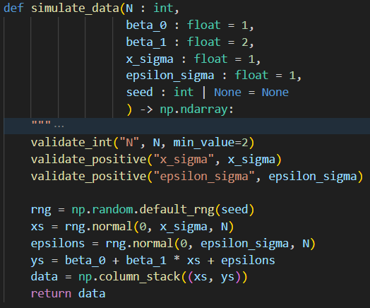

**R:**

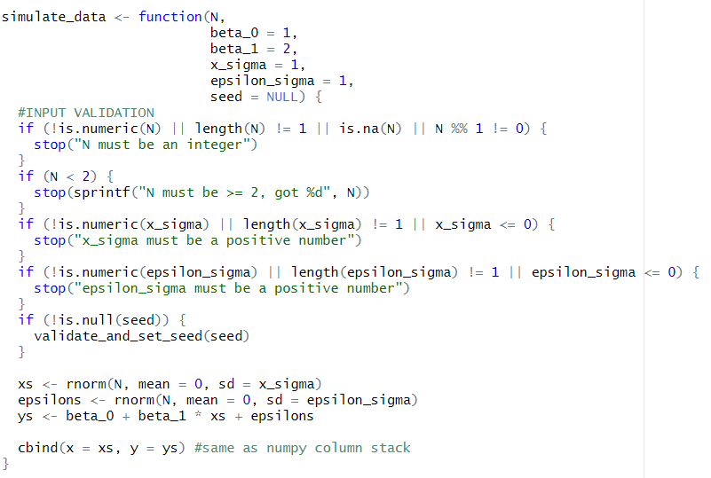

- Instead of just sigma, had `sigma_x` and `sigma_epsilon` for generality
- RNG seed for reproducibility (saved with results)
- Data stored in numpy arrays but validation accepts array-like (lists, pd.Series, etc.)

---

## Simulated data distribution

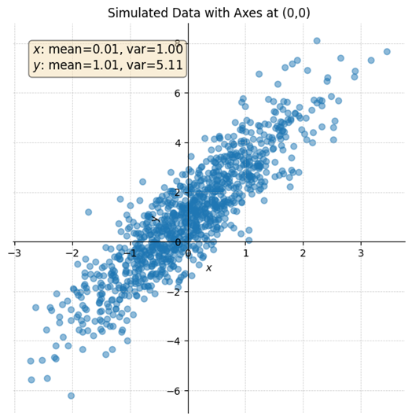

- Means and variances are correct
- Data saved into CSV in artifacts folder

---

## Simulation variance formula

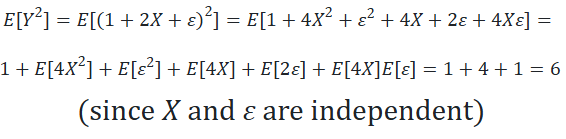

---

## Estimate beta

Simple approach:

**Python:**

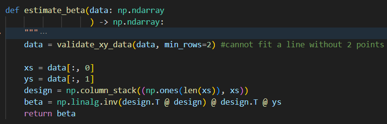

**R:**

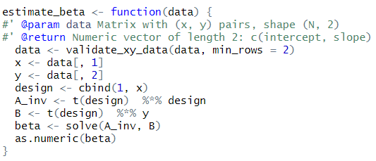

---

## Estimate beta - alternative approach

- Tried `np.linalg.lstsq()` too
- Results: not actually faster (tried until I ran out of memory), and produced same results numerically
- This is just due to 2×2 matrix inversion being very fast - for higher dimensions it is worth using `lstsq()`

---

## Bootstrap sampling

**Python:**

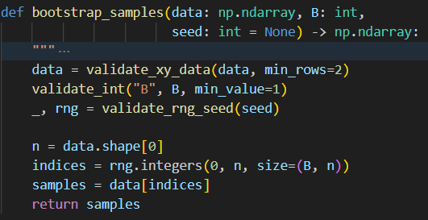

**R:**

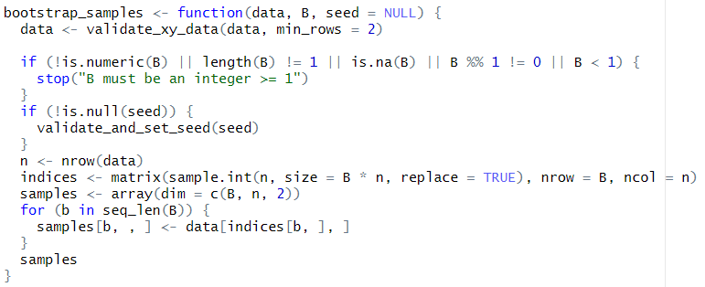

- Vectorized implementation
- Memory tradeoff

---

## Standard deviation

**Python:**

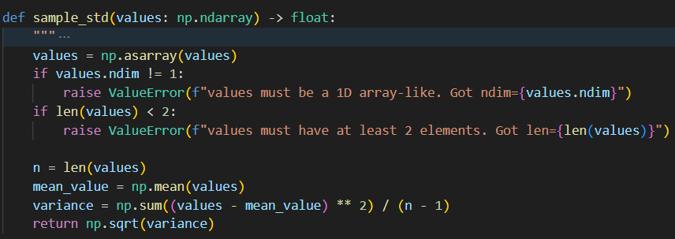

**R:**

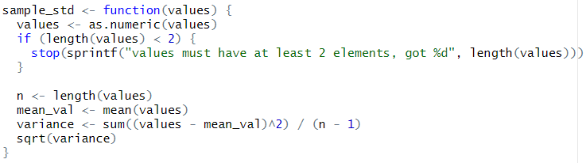

---

## Beta standard error from bootstrap

**Python:**

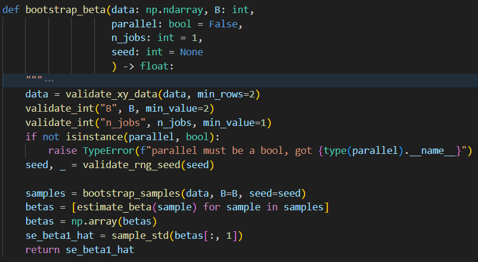

**R:**

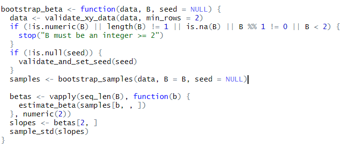

---

## Parallelization

Four options considered:

- **Multithreading**
- **Multiprocessing**
- **Distributed computing**
- **Hardware acceleration** (via vectorization)

---

## Parallelization - implementation

Using **Joblib** for multiprocessing and multithreading:

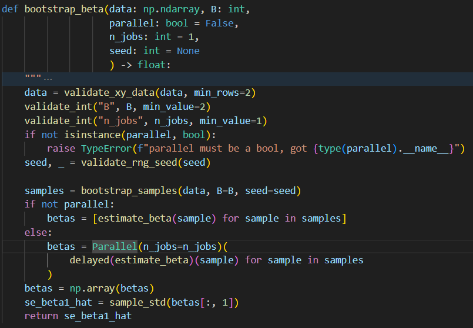

---

## Parallelization - results

- Didn't speed up for this case
- Reason: `estimate_beta()` calls are still very fast (2×2 matrix inversion), so the overhead of parallelization is not worth it here
- On more sophisticated (8D) data, it tested to be faster

---

## Input sanity checks

**R:**

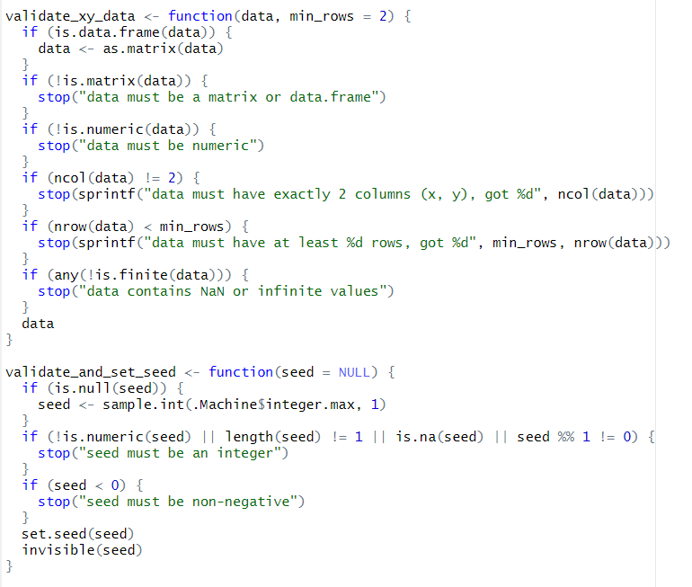

**Python:**

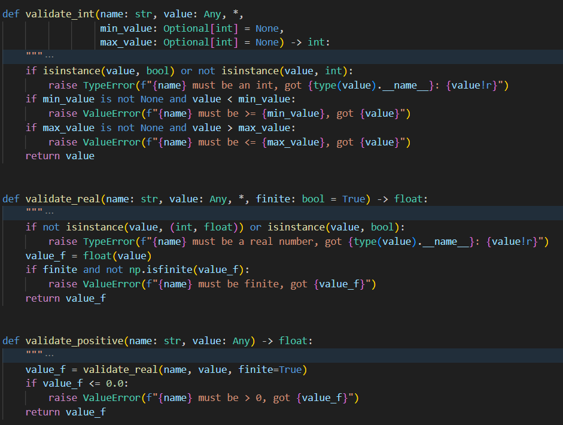
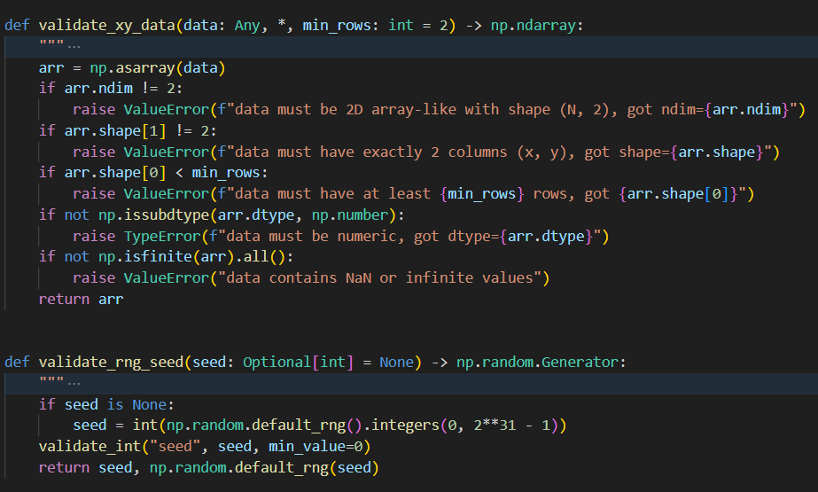

Standard checks in Python - functions for range, type, shape written in `utils.py` and called at function entrypoints.

---

## Tests

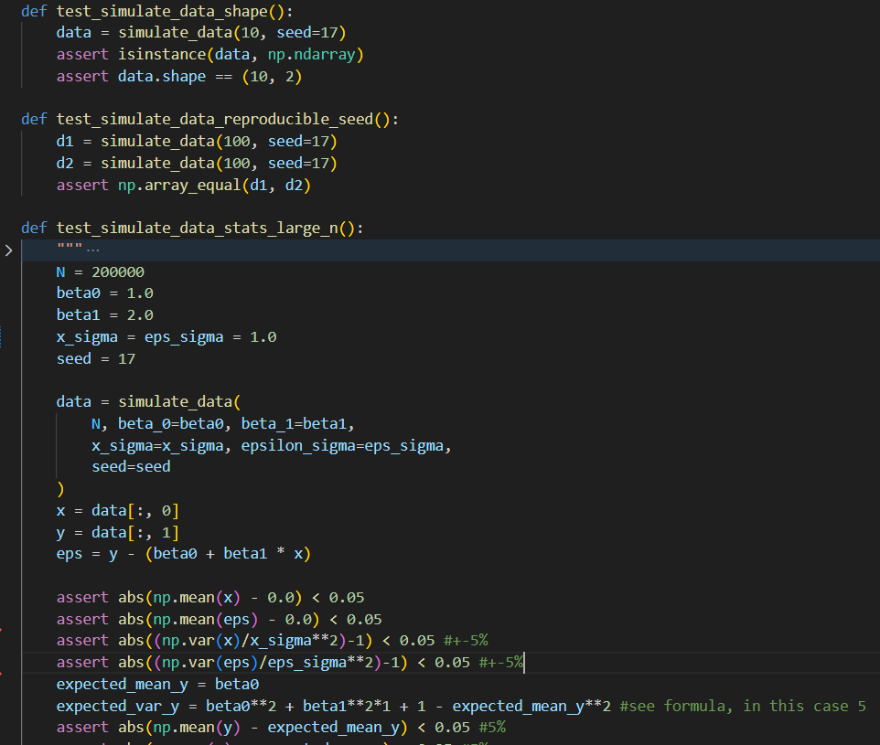
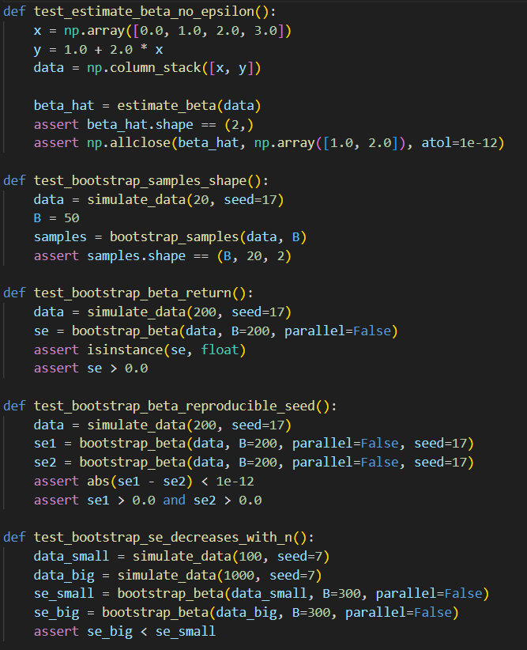

- **Pytest** (GitHub Actions automated)
- Model sanity: across many Monte Carlo repetitions, similar value for `beta_hat` (converges to `beta_true`)

---

## Choosing B value

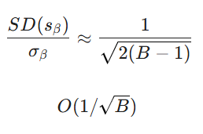

**Option A:** 5% relative error (to original variance) at around B=200

**Option B:** "Parameter-tuning for B" - increase B gradually, cut off SE after less than 1% diff between one measurement and k-100th measurement

---

## CLI and data storage

- Command-line interface implemented
- Tried for R too with AI help, has bugs though

---

## GitHub actions

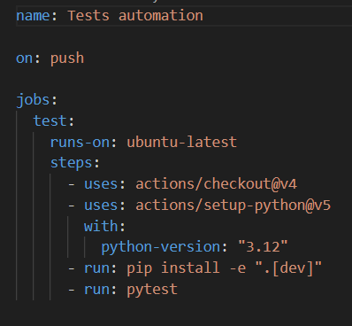

Automated testing on push.

---

## Others

- Docstrings
- Type hints
- Packaging as module
- README documentation

### For future:

- **Linting** (with ruff): Auto checks code for bugs, PEP8 style guide violations, complexity
- **Formatting**: Auto formats code (ruff, black)
- **Documentation**: Auto-generation possible with Sphinx, pdoc or pydocstyle
- Could use `**kwargs` to simplify, or at least params dict: `{'N': N, 'sigma': sigma, ...}`